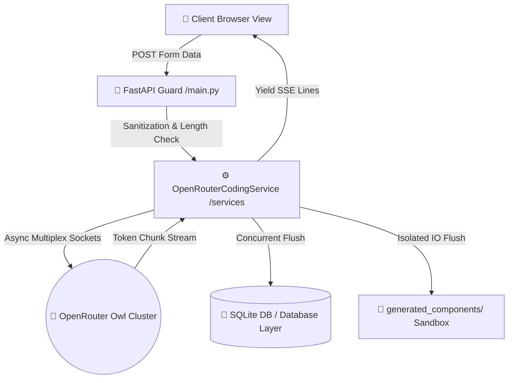

<div align="center">

# 🌌 Agentic Code Studio
### *Next-Gen Asynchronous Enterprise Code Generation Engine*

[](https://fastapi.tiangolo.com)
[](https://www.sqlalchemy.org)
[](https://www.uvicorn.org)
[](https://tailwindcss.com)
[](https://openrouter.ai)

<p align="center">
  A high-performance, asynchronous code-scaffolding and generation studio leveraging OpenRouter clusters. Featuring real-time Server-Sent Events (SSE) streaming, deep multi-layer pipeline validation, path-traversal security sandboxing, and persistent relational transaction logging.
</p>

[✨ Core Features](#-core-features) • [🏗️ Architecture Blueprint](#%EF%B8%8F-architecture-blueprint) • [🚀 Quickstart Pipeline](#-quickstart-pipeline) • [📁 System Directory Layout](#-system-directory-layout)

---
</div>

## ✨ Core Features

* **⚡ Real-Time SSE Token Streaming**: Asynchronous data chunk consumption from upstream OpenRouter macro context nodes directly down to the browser layout without blocking execution threads.
* **🛡️ Secure Workspace Sandboxing**: Structural filename scanning (`..`, `/`, `~` extraction mitigation) with target base directory lockouts preventing server-side path traversal escapes.
* **🔌 Active Network Circuit Breaking**: Intercepts client connection state (`request.is_disconnected()`) and triggers a safe pipeline termination routine to save upstream token costs.
* **📊 Relational Audit Trailing**: Automatic schema mapping via SQLAlchemy ORM into an optimized SQLite tracking ledger capturing prompt contexts and full source-code payloads.
* **🎨 Cyberpunk Dark-Mode UI**: Immersive high-contrast interface built with premium utility-first components, interactive live character bounds, dynamic visual line-counters, and instant clipboard buffers.

---

## 🏗️ Architecture Blueprint

The ecosystem adheres to a strict decoupled architectural flow, separating network routing, business logic orchestration, and relational data layers:



---

## 🛠️ Technical Matrix Stack

| Architectural Layer | Technology Stack Component | Role Description |
| --- | --- | --- |
| **Asynchronous Web Core** | FastAPI + Uvicorn ASGI | Non-blocking network gateway router and schema validation compiler. |
| **LLM Orchestration** | AsyncOpenAI Engine Client | Concurrent pipeline socket streaming wrapper tuned for OpenRouter. |
| **Persistence Engine** | SQLAlchemy 2.0 + SQLite | Structural execution auditing and multi-model database storage. |
| **Interface Compositing** | Jinja2 Templates + Tailwind CSS | Dynamic serverside HTML injection paired with a custom dark-mode theme. |
| **Configuration Guard** | Python Decouple | Isolation of system-wide variables and strict operational boundaries. |

---

## 🚀 Quickstart Pipeline

### 1. Initialize Local Virtual Environment

```bash
python -m venv venv
# Windows PowerShell Execution Activation
.\venv\Scripts\Activate.ps1

```

### 2. Deploy Workspace Dependencies

```bash
pip install fastapi uvicorn sqlalchemy jinja2 python-decouple openai python-multipart

```

### 3. Inject Runtime Environment Variables

Create a file named `.env` inside the absolute root directory of the repository:

```env
OPENROUTER_API_KEY=your_secret_openrouter_api_key_token_here
MAX_PROMPT_LENGTH=15000

```


### 4. Ignite the Production ASGI Web Server

```bash
python -m uvicorn main:app --reload

```

Once ignited, map your browser routing vector to: `http://127.0.0.1:8000`

---

## 📁 System Directory Layout

```text
.
├── 📂 generated_components/   # Isolated code asset output sandbox directory
├── 📂 services/
│   └── 📄 openrouter_service.py # Core business layer logic & Async client setup
├── 📂 static/
│   └── 📂 css/
│       └── 📄 style.css       # Custom styles, line counters & dark themes
├── 📂 templates/
│   └── 📄 index.html          # Embedded Jinja2 frontend template block
├── 📄 database.py             # SQLAlchemy configuration & Engine session handlers
├── 📄 models.py               # Declarative DB schemas (generation_history)
├── 📄 schemas.py              # Pydantic contract payloads for strict types
├── 📄 main.py                 # FastAPI application router lifecycle engine
├── 📄 .env                    # Decoupled local secret key-value repository
└── 📄 openrouter_studio.db    # Relational SQLite physical file binary

```

---

## 🛡️ Sandbox Security Architecture

> [!IMPORTANT]
> The generation router strictly guarantees compilation safety by checking all incoming path variables against the base directory runtime path using Python's `Path.resolve()` boundary matching:
> ```python
> safe_target_path = (TARGET_BASE_DIR / filename).resolve()
> if not str(safe_target_path).startswith(str(TARGET_BASE_DIR)):
>     raise HTTPException(status_code=400, detail="Security sandbox violation.")
> 
> ```
> 
> 

---
