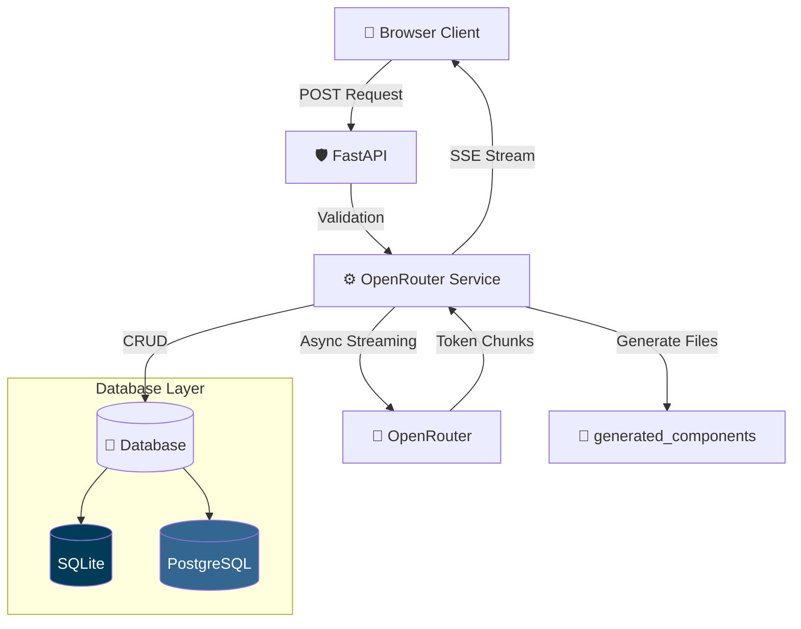

<div align="center">

# 🌌 OWL Studio — Intelligence Terminal

### *Next-Gen AI Chat & Code Generation Platform*

[](https://fastapi.tiangolo.com)
[](https://www.sqlalchemy.org)
[](https://www.postgresql.org)
[](https://www.sqlite.org)
[](https://tailwindcss.com)
[](https://openrouter.ai)

<p align="center">
A high-performance AI chat and code generation studio with dual-database support, real-time SSE streaming, auto-sync migration, and intelligent document text extraction.
</p>

[✨ Core Features](#-core-features) • [🏗️ Architecture](#️-architecture-blueprint) • [🚀 Quickstart](#-quickstart-pipeline) • [📁 Directory Structure](#-system-directory-layout)

</div>

---

## ✨ Core Features

* 💬 Persistent Chat Sessions with create, rename, and delete functionality
* ⚡ Real-Time SSE Token Streaming from OpenRouter
* 🔄 Dual Database Support (SQLite / PostgreSQL)
* 🔁 Auto-Sync Migration between databases
* 📄 Smart PDF/DOCX/TXT Extraction with RTL support
* 🛡️ Secure Workspace Sandboxing
* 🔌 Intelligent Circuit Breaking
* 📝 Multiple System Instruction Profiles
* 🎨 Cyberpunk Dark UI with live indicators

---

## 🏗️ Architecture Blueprint



---

## 🛠️ Technical Stack

| Layer           | Technology                     | Role                   |
| --------------- | ------------------------------ | ---------------------- |
| Async Framework | FastAPI + Uvicorn              | API & SSE Streaming    |
| LLM Client      | AsyncOpenAI                    | OpenRouter integration |
| Database        | SQLAlchemy + SQLite/PostgreSQL | Dual DB support        |
| Frontend        | Jinja2 + Tailwind CSS          | Dynamic UI             |
| File Processing | pdfplumber, python-docx, pptx  | Text extraction        |
| Configuration   | Python Decouple                | Environment management |

---

## 📥 Download & Install Prerequisites

Install the following:

* Python 3.12+
* Git for Windows
* PostgreSQL 17 (Optional)

Important during Python installation:

* Enable:

```plaintext
Add Python.exe to PATH
```

---

## 🚀 Quickstart Pipeline

### 1. Clone Repository & Create Environment

```bash
git clone https://github.com/saeidsaadatigero/OpenRouter_API_aggregator_with-Owl-Alpha.git

cd OpenRouter_API_aggregator_with-Owl-Alpha

python -m venv venv
```

Windows PowerShell:

```bash
.\venv\Scripts\Activate.ps1
```

Linux/macOS:

```bash
source venv/bin/activate
```

---

### 2. Install Dependencies

```bash
pip install -r requirements.txt
```

---

### 3. Configure Environment Variables

Create `.env`

```env
# Database Engine
DB_ENGINE=sqlite

# SQLite
SQLITE_PATH=./openrouter_studio.db

# PostgreSQL
POSTGRES_HOST=localhost
POSTGRES_PORT=5432
POSTGRES_USER=owl_user
POSTGRES_PASSWORD=123456
POSTGRES_DB=owl

# OpenRouter
OPENROUTER_API_KEY=sk-or-xxxxxxxxxxxxxxxx
MAX_PROMPT_LENGTH=200000
MAX_CHARS=200000
```

---

### 4. Run Server

```bash
python -m uvicorn main:app --reload
```

Open:

```plaintext
http://127.0.0.1:8000
```

---

## 🔄 Database Migration & Auto Switch

Switch to PostgreSQL:

```env
DB_ENGINE=postgres
```

```bash
python -m uvicorn main:app --reload
```

Switch back:

```env
DB_ENGINE=sqlite
```

```bash
python -m uvicorn main:app --reload
```

---

### Manual Migration Commands

```bash
python migrate.py check

python migrate.py sqlite-to-postgres

python migrate.py postgres-to-sqlite
```

---

### Database API Endpoints

```bash
curl http://localhost:8000/api/db-status

curl -X POST http://localhost:8000/api/sync-to-postgres

curl -X POST http://localhost:8000/api/sync-to-sqlite
```

---

## 📁 System Directory Layout

```plaintext
.
├── generated_components/
├── services/
│   ├── openrouter_service.py
│   ├── chat_service.py
│   ├── instruction_service.py
│   └── file_service.py
│
├── static/
│   └── css/
│       └── style.css
│
├── templates/
│   └── index.html
│
├── database.py
├── models.py
├── schemas.py
├── migrate.py
├── main.py
├── .env
├── openrouter_studio.db
└── requirements.txt
```

---

## 🗄️ Database Schema

### Chat Sessions

| Column     | Type     | Description   |
| ---------- | -------- | ------------- |
| id         | Integer  | Session ID    |
| title      | String   | Session title |
| created_at | DateTime | Creation date |
| updated_at | DateTime | Update date   |

### Chat Messages

| Column     | Type     | Description        |
| ---------- | -------- | ------------------ |
| id         | Integer  | Message ID         |
| session_id | Integer  | Session reference  |
| role       | String   | User or assistant  |
| content    | Text     | Message content    |
| status     | String   | pending/done/error |
| created_at | DateTime | Creation date      |

### System Instructions

| Column    | Type    | Description    |
| --------- | ------- | -------------- |
| id        | Integer | Instruction ID |
| title     | String  | Name           |
| content   | Text    | Full content   |
| is_active | Boolean | Active state   |

---

## 🛡️ Security Features

### Path Traversal Protection

```python
safe_path = (TARGET_BASE_DIR / filename).resolve()

if not str(safe_path).startswith(str(TARGET_BASE_DIR)):
    raise HTTPException(
        status_code=400,
        detail="Security sandbox violation."
    )
```

### Input Validation

* File extension whitelist
* Max file size limit (50MB)
* Prompt length limit

### Database Security

* SQLAlchemy parameterized queries
* Foreign key constraints
* No raw SQL

---

## 🌐 API Endpoints

### Chat Operations

| Method | Endpoint                | Description    |
| ------ | ----------------------- | -------------- |
| GET    | /                       | Main page      |
| POST   | /api/chat/new           | Create session |
| POST   | /api/chat/{id}/rename   | Rename session |
| POST   | /api/chat/{id}/delete   | Delete session |
| POST   | /api/chat/{id}/send     | Send message   |
| GET    | /api/chat/{id}/messages | Get messages   |

### System Instructions

| Method | Endpoint                 | Description        |
| ------ | ------------------------ | ------------------ |
| GET    | /api/instructions        | List instructions  |
| GET    | /api/instructions/active | Active instruction |
| POST   | /api/instructions        | Create instruction |
| PUT    | /api/instructions/{id}   | Update instruction |
| DELETE | /api/instructions/{id}   | Delete instruction |

### File Operations

| Method | Endpoint    | Description           |
| ------ | ----------- | --------------------- |
| POST   | /api/upload | Upload & extract file |

---

## 🎨 UI Features

* 🌙 Dark / Light Mode
* 📊 Character Counter
* ⌨️ Typing Indicator
* 📋 Copy Code Button
* 🔄 Message Regeneration
* ✏️ Inline Editing
* 📱 Responsive Design
* 🌐 RTL Support

---

<div align="center">

Built with ❤️ by Saeid Saadatigero

If you found this useful, consider giving the repository a ⭐

</div>
