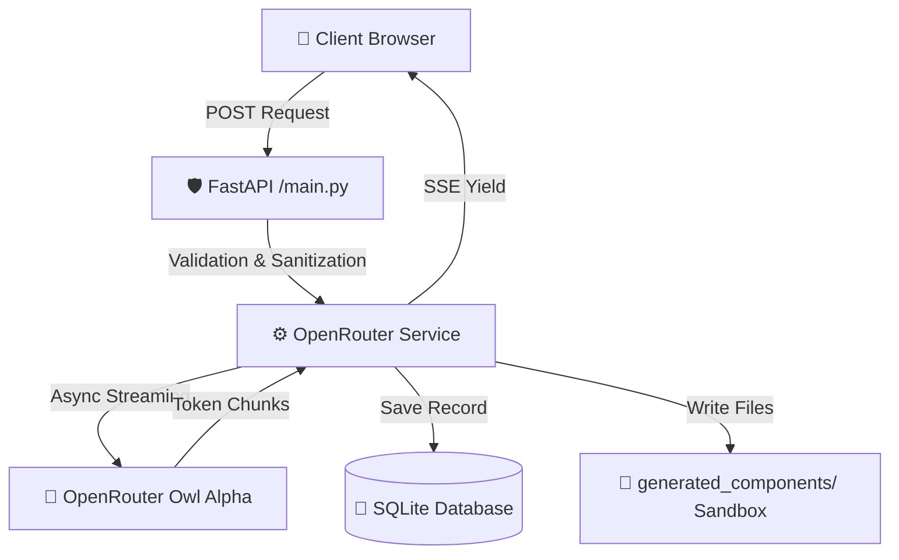

<div align="center">

# 🌌 Agentic Code Studio
### *Next-Gen Asynchronous Enterprise Code Generation Engine*

[](https://fastapi.tiangolo.com)
[](https://www.sqlalchemy.org)
[](https://www.uvicorn.org)
[](https://tailwindcss.com)
[](https://openrouter.ai)

<p align="center">
  A high-performance, asynchronous AI code generation studio powered by OpenRouter (Owl Alpha). 
  Features real-time Server-Sent Events streaming, robust security sandboxing, intelligent circuit breaking, 
  and persistent audit logging.
</p>

[✨ Core Features](#-core-features) • [🏗️ Architecture](#️-architecture-blueprint) • [🚀 Quickstart](#-quickstart-pipeline) • [📁 Directory Structure](#-system-directory-layout)

---
</div>

## ✨ Core Features

- **⚡ Real-Time SSE Token Streaming**: Asynchronous streaming from OpenRouter directly to the browser with zero blocking.
- **🛡️ Secure Workspace Sandboxing**: Strong protection against path traversal attacks (`..`, `/`, `~`) with strict base directory enforcement.
- **🔌 Intelligent Circuit Breaking**: Automatically cancels generation if the client disconnects to prevent unnecessary token usage.
- **📊 Relational Audit Trail**: Full history of prompts and generated code stored persistently using SQLAlchemy + SQLite.
- **🎨 Cyberpunk Dark UI**: Modern, high-contrast interface with live character counting, dynamic line counters, and instant copy functionality.

---

## 🏗️ Architecture Blueprint



---

## 🛠️ Technical Stack

| Layer                    | Technology                        | Role |
|-------------------------|-----------------------------------|------|
| **Async Web Framework** | FastAPI + Uvicorn                 | High-performance API and SSE streaming |
| **LLM Client**          | AsyncOpenAI                       | Optimized connection to OpenRouter |
| **Database**            | SQLAlchemy 2.0 + SQLite           | Persistent generation history |
| **Frontend**            | Jinja2 + Tailwind CSS             | Dynamic dark cyberpunk interface |
| **Configuration**       | Python Decouple                   | Secure environment management |

---

# 📥 Download and Install Prerequisites

Open your browser and download and install the following programs:

1. **[Python 3.12.10 (Stable)](https://www.python.org/ftp/python/3.12.10/python-3.12.10-amd64.exe)**: Download the `Windows installer (64-bit)` file directly (this is the latest official binary version of Python 3.12). ⚠️ **Very Important:** On the first installation screen, be sure to check **"Add Python.exe to PATH"** and then click Install Now.

2. **[Git for Windows](https://github.com/git-for-windows/git/releases/download/v2.45.0.windows.1/Git-2.45.0-64-bit.exe)**: Run the file and simply click `Next` until the end (default settings are excellent).

## 🚀 Quickstart Pipeline

### 1. Clone & Setup Environment
```bash
git clone https://github.com/saeidsaadatigero/OpenRouter_API_aggregator_with-Owl-Alpha.git
cd OpenRouter_API_aggregator_with-Owl-Alpha

python -m venv venv

# Windows
.\venv\Scripts\Activate.ps1

# Linux / macOS
source venv/bin/activate
```

### 2. Install Dependencies
```bash
pip install fastapi uvicorn sqlalchemy jinja2 python-decouple openai python-multipart
```

### 3. Configure Environment Variables
Create `.env` file in the project root:
```env
OPENROUTER_API_KEY=sk-or-XXXXXXXXXXXXXXXXXXXXXXXX
MAX_PROMPT_LENGTH=100000
MAX_CONTEXT_TOKENS=100000
```

### 4. Run the Server
```bash
python -m uvicorn main:app --reload
```

Open your browser and go to: **`http://127.0.0.1:8000`**

---

## 📁 System Directory Layout

```text
.
├── 📂 generated_components/          # Sandbox for generated code outputs
├── 📂 services/
│   └── 📄 openrouter_service.py      # Core OpenRouter orchestration logic
├── 📂 static/
│   └── 📂 css/
│       └── 📄 style.css              # Custom styles & dark theme
├── 📂 templates/
│   └── 📄 index.html                 # Jinja2 main template
├── 📄 database.py                    # SQLAlchemy setup & sessions
├── 📄 models.py                      # Database models
├── 📄 schemas.py                     # Pydantic validation schemas
├── 📄 main.py                        # FastAPI application entrypoint
├── 📄 .env                           # Environment variables
└── 📄 openrouter_studio.db           # SQLite database file
```

---

## 🛡️ Sandbox Security Architecture

> [!IMPORTANT]
> All file paths are strictly validated using `Path.resolve()` to prevent directory traversal:
> 
> ```python
> safe_path = (TARGET_BASE_DIR / filename).resolve()
> if not str(safe_path).startswith(str(TARGET_BASE_DIR)):
>     raise HTTPException(status_code=400, detail="Security sandbox violation.")
> ```

---

**Built with ❤️ for high-performance AI code generation**

*Star the repository if you like the project! ⭐*
