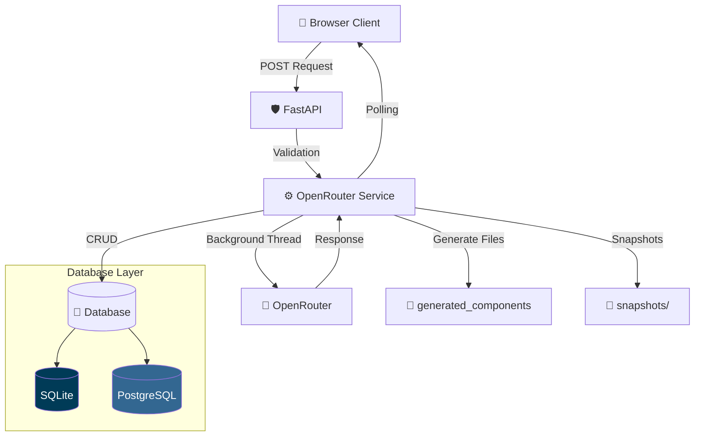

<div align="center">

# 🌌 OWL Studio — Intelligence Terminal

### *Next-Gen AI Chat & Code Generation Platform*

[](https://fastapi.tiangolo.com)
[](https://www.sqlalchemy.org)
[](https://www.postgresql.org)
[](https://www.sqlite.org)
[](https://tailwindcss.com)
[](https://openrouter.ai)

<p align="center">
A high-performance AI chat and code generation studio with dual-database support, real-time SSE streaming, context-aware snapshot system, and intelligent document text extraction.
</p>

[✨ Core Features](#-core-features) • [🏗️ Architecture](#️-architecture-blueprint) • [🚀 Quickstart](#-quickstart-pipeline) • [📁 Directory Structure](#-system-directory-layout)

</div>

---

## ✨ Core Features

- 💬 Persistent Chat Sessions with create, rename, and delete functionality
- ⚡ Real-Time Background LLM Processing with manual Stop & Retry
- 📸 Smart Snapshot System — AI-generated project summaries with full history clear & context restore
- 📊 Token Usage Bar with 85%/90%/95%/100% warning modals (Persian UI)
- 🗜️ Context Compression — automatic smart trimming when approaching token limits
- 🔄 Dual Database Support (SQLite / PostgreSQL)
- 🔁 Auto-Sync Migration between databases
- 📄 Smart PDF/DOCX/TXT/PPTX/XLSX Extraction with Persian RTL detection & direction fix
- 🛡️ Secure Workspace Sandboxing with path traversal protection
- 🔌 Intelligent Circuit Breaking & cancellation
- 📝 Multiple System Instruction Profiles with CRUD
- 🎨 Cyberpunk Dark/Light UI with live indicators
- 🌐 Persian & English mixed UI
- 📦 Export chat as JSON, Markdown, or Text

---

## 🏗️ Architecture Blueprint



---

## 🛠️ Technical Stack

| Layer              | Technology                     | Role                      |
| ------------------ | ------------------------------ | ------------------------- |
| Async Framework    | FastAPI + Uvicorn              | API & SSE Streaming       |
| LLM Client         | OpenAI (Sync + Async)          | OpenRouter integration    |
| Database           | SQLAlchemy + SQLite/PostgreSQL | Dual DB support           |
| Frontend           | Jinja2 + Tailwind CSS          | Dynamic UI                |
| File Processing    | pdfplumber, python-docx, pptx, openpyxl | Text extraction   |
| Configuration      | Python Decouple                | Environment management    |
| Background Tasks   | threading + cancellation       | Non-blocking LLM calls    |

---

## 📥 Download & Install Prerequisites

Install the following:

- Python 3.12+
- Git for Windows
- PostgreSQL 17 (Optional)

Important during Python installation:

- Enable:

```plaintext
Add Python.exe to PATH
```

---

## 🚀 Quickstart Pipeline

### 1. Clone Repository & Create Environment

```bash
git clone https://github.com/saeidsaadatigero/OpenRouter_API_aggregator_with-Owl-Alpha.git

cd OpenRouter_API_aggregator_with-Owl-Alpha

python -m venv venv
```

Windows PowerShell:

```bash
.\venv\Scripts\Activate.ps1
```

Linux/macOS:

```bash
source venv/bin/activate
```

---

### 2. Install Dependencies

```bash
pip install -r requirements.txt
```

---

### 3. Configure Environment Variables

Create `.env`

```env
# Database Engine (sqlite or postgres)
DB_ENGINE=sqlite

# SQLite
SQLITE_PATH=./openrouter_studio.db

# PostgreSQL (only if DB_ENGINE=postgres)
POSTGRES_HOST=localhost
POSTGRES_PORT=5432
POSTGRES_USER=owl_user
POSTGRES_PASSWORD=123456
POSTGRES_DB=owl

# OpenRouter
OPENROUTER_API_KEY=sk-or-xxxxxxxxxxxxxxxx
MAX_PROMPT_LENGTH=200000
MAX_CHARS=200000
MAX_CONTEXT_TOKENS=200000
```

---

### 4. Run Server

```bash
python -m uvicorn main:app --reload
```

Open:

```plaintext
http://127.0.0.1:8000
```

---

## 🔄 Database Migration & Auto Switch

Switch to PostgreSQL:

```env
DB_ENGINE=postgres
```

```bash
python -m uvicorn main:app --reload
```

Switch back:

```env
DB_ENGINE=sqlite
```

```bash
python -m uvicorn main:app --reload
```

---

### Manual Migration Commands

```bash
python migrate.py check

python migrate.py sqlite-to-postgres

python migrate.py postgres-to-sqlite
```

---

### Database API Endpoints

```bash
curl http://localhost:8000/api/db-status

curl -X POST http://localhost:8000/api/sync-to-postgres

curl -X POST http://localhost:8000/api/sync-to-sqlite
```

---

## 📁 System Directory Layout

```plaintext
.
├── generated_components/          # Output code files
├── snapshots/                     # AI-generated project snapshots
├── services/
│   ├── openrouter_service.py      # OpenRouter API client
│   ├── chat_service.py            # Session & token management
│   ├── instruction_service.py     # System instructions CRUD
│   ├── file_service.py            # Document text extraction
│   └── snapshot_service.py        # Project snapshot system
│
├── static/
├── templates/
│   └── index.html                 # Full SPA frontend
│
├── database.py                    # DB engine, connection, auto-sync
├── models.py                      # SQLAlchemy models
├── schemas.py                     # Pydantic schemas
├── migrate.py                     # CLI migration tool
├── main.py                        # FastAPI application
├── test_openrouter_connection.py  # Connection test
├── .env
├── .gitignore
├── openrouter_studio.db
└── requirements.txt
```

---

## 🗄️ Database Schema

### Chat Sessions

| Column     | Type     | Description   |
| ---------- | -------- | ------------- |
| id         | Integer  | Session ID    |
| title      | String   | Session title |
| created_at | DateTime | Creation date |
| updated_at | DateTime | Update date   |

### Chat Messages

| Column     | Type     | Description                      |
| ---------- | -------- | -------------------------------- |
| id         | Integer  | Message ID                       |
| session_id | Integer  | Session reference                |
| role       | String   | user / assistant / system        |
| content    | Text     | Message content                  |
| status     | String   | pending / done / error / cancelled |
| created_at | DateTime | Creation date                    |

### System Instructions

| Column     | Type     | Description    |
| ---------- | -------- | -------------- |
| id         | Integer  | Instruction ID |
| title      | String   | Name           |
| content    | Text     | Full content   |
| is_active  | Boolean  | Active state   |
| created_at | DateTime | Creation date  |
| updated_at | DateTime | Update date    |

### Generation History

| Column         | Type     | Description     |
| -------------- | -------- | --------------- |
| id             | Integer  | Record ID       |
| prompt         | String   | User prompt     |
| generated_code | Text     | Output code     |
| filename       | String   | Saved filename  |
| created_at     | DateTime | Creation date   |

---

## 🛡️ Security Features

### Path Traversal Protection

```python
safe_path = (TARGET_BASE_DIR / filename).resolve()

if not str(safe_path).startswith(str(TARGET_BASE_DIR)):
    raise HTTPException(
        status_code=400,
        detail="Security sandbox violation."
    )
```

### Input Validation

- File extension whitelist
- Max file size limit (50MB)
- Prompt length limit via Pydantic

### Database Security

- SQLAlchemy parameterized queries
- Foreign key constraints with CASCADE delete
- No raw SQL in API endpoints

---

## 🌐 API Endpoints

### Chat Operations

| Method | Endpoint                      | Description              |
| ------ | ----------------------------- | ------------------------ |
| GET    | /                             | Main page                |
| GET    | /chat/{id}                    | Continue session         |
| POST   | /api/chat/new                 | Create session           |
| POST   | /api/chat/{id}/rename         | Rename session           |
| POST   | /api/chat/{id}/delete         | Delete session           |
| POST   | /api/chat/{id}/send           | Send message             |
| POST   | /api/chat/{id}/generate       | Generate code (SSE)      |
| GET    | /api/chat/{id}/messages       | Get session messages     |
| POST   | /api/chat/{id}/compress       | Compress history         |
| GET    | /api/message/{id}/status      | Poll message status      |
| POST   | /api/message/{id}/stop        | Stop generation          |

### Snapshot & Token

| Method | Endpoint                         | Description              |
| ------ | -------------------------------- | ------------------------ |
| GET    | /api/session/{id}/token-status   | Token usage details      |
| GET    | /api/session/{id}/token-bar      | Visual bar data          |
| POST   | /api/session/{id}/snapshot       | Create project snapshot  |
| GET    | /api/snapshots                   | List all snapshots       |
| GET    | /api/snapshots/{filename}        | Download snapshot        |
| DELETE | /api/snapshots/{filename}        | Delete snapshot          |

### System Instructions

| Method | Endpoint                       | Description             |
| ------ | ------------------------------ | ----------------------- |
| GET    | /api/instructions              | List instructions       |
| GET    | /api/instructions/active       | Active instruction      |
| GET    | /api/instructions/{id}         | Get instruction         |
| POST   | /api/instructions              | Create instruction      |
| PUT    | /api/instructions/{id}         | Update instruction      |
| DELETE | /api/instructions/{id}         | Delete instruction      |
| POST   | /api/instructions/{id}/activate| Set as active           |
| POST   | /api/instructions/initialize-default | Reset to default  |

### File Operations

| Method | Endpoint    | Description              |
| ------ | ----------- | ------------------------ |
| POST   | /api/upload | Upload & extract file    |

### Database Operations

| Method | Endpoint             | Description          |
| ------ | -------------------- | -------------------- |
| GET    | /api/config          | Frontend config      |
| GET    | /api/db-status       | Database stats       |
| POST   | /api/sync-to-postgres| SQLite → PostgreSQL  |
| POST   | /api/sync-to-sqlite  | PostgreSQL → SQLite  |

---

## 🎨 UI Features

- 🌙 Dark / Light Mode toggle with persistence
- 📊 Live Token Usage Progress Bar in header
- 🚨 Smart Alert Modals (85%/90%/95%/100% context) in Persian
- 📸 Snapshot System — AI summary + history clear + one-click restore
- 🗜️ Compress Chat History with statistics
- 📎 File Upload with instant text extraction
- 📋 Copy Code Button per code block
- 🔄 Message Regeneration & Retry
- ✏️ Inline Message Editing
- ⏹ Stop Generation with real cancellation
- 📦 Export Chat as JSON / Markdown / Text
- 📱 Fully Responsive Design
- 🌐 RTL Persian Support

---

<div align="center">

Built with ❤️ by Saeid Saadatigero

If you found this useful, consider giving the repository a ⭐

</div>